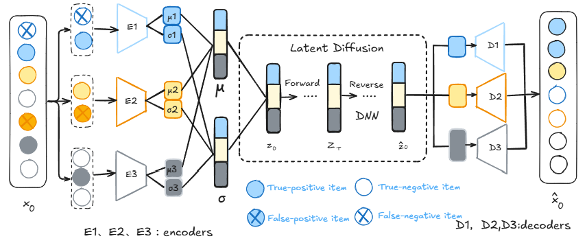
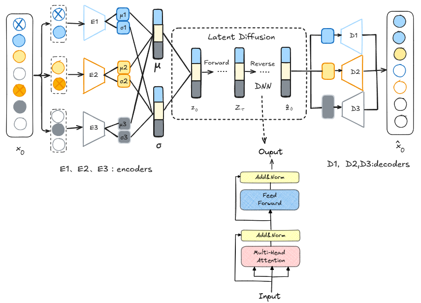
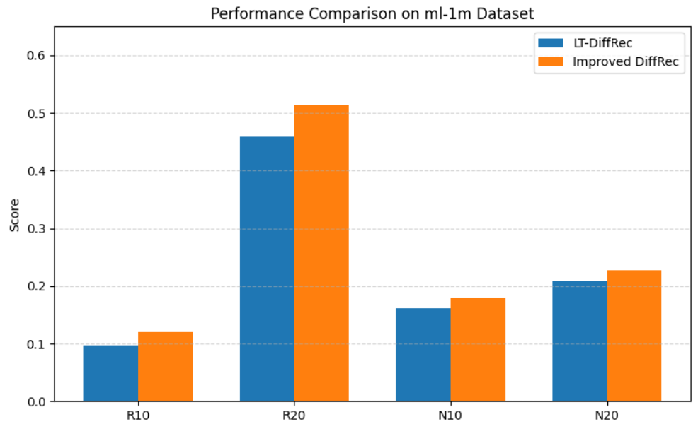

## 改进型LT-DIffRec

原论文github地址：[YiyanXu/DiffRec: Diffusion Recommender Model](https://github.com/YiyanXu/DiffRec)

原模型结构：

**结合 Transformer** → 增强用户行为序列的建模效果

原论文采用DNN作为反向扩散模型，替换成Transformer encoder

实验：

